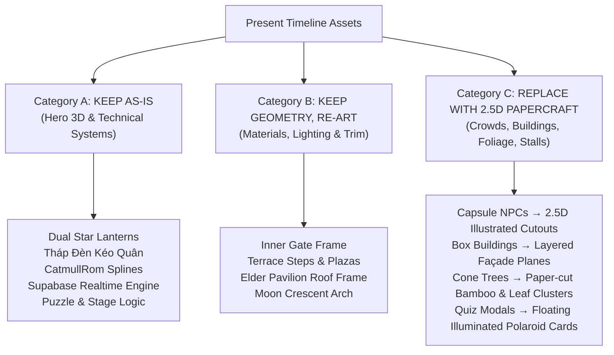
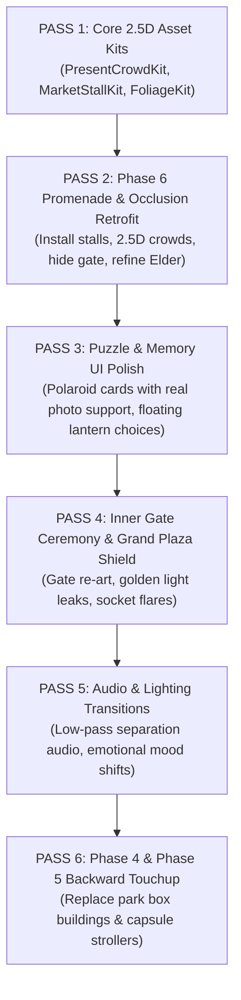

# PRESENT TIMELINE VISUAL AUDIT (PHASE 4 → PHASE 6)
**Master Art-Direction & Technical Implementation Specification**
**Authority:** `PRESENT_VISUAL_IDENTITY.md` & `AGENTS.md`  
**Standard:** Modern Illuminated Papercraft Diorama (2.5D / Layered Depth / Silhouette-First)  
**Scope:** Inspection Only (Phases 4A–4C, 5A–5C, 6A–6E)

---

## 1. Executive Summary

### 1.1 The Core Diagnosis: "Why the Present Drifted Away"
In the ancient village timeline (Phases 1–3), every frame felt like a living shadow puppet theatre and traditional Vietnamese papercraft pop-up book (*tranh cắt giấy & nghệ thuật múa rối bóng*). Flat planes (`PlaneGeometry`) were layered along the Z-axis, creating sharp silhouette contours, natural rim lighting, and a handcrafted folk-art intimacy.

However, as the game transitioned into the modern present (Phases 4–6) and adopted a third-person walking camera along `CatmullRomCurve3` rails, an unconscious technical shift occurred:
1. **Geometric Over-Solidification:** Instead of evolving the papercraft grammar into a modern illuminated diorama, the implementation reverted to primitive, volumetric 3D shapes:
   - Capsule/cylinder meshes (`CapsuleGeometry`) as human beings (greybox pawns).
   - Monolithic solid boxes (`BoxGeometry`) as buildings and walls.
   - Sharp cone trees (`ConeGeometry`) as foliage.
2. **Loss of Silhouette Rim & Paper Translucency:** The flat cardboard layering that caught rim light so beautifully in the past was replaced by unshaded flat-colored standard materials (`MeshStandardMaterial`), turning what should be a vibrant Mid-Autumn night into a sterile, dark polygon landscape.
3. **Premature Focal Exposure:** Open lines-of-sight in Phase 6 exposed the destination (Inner Gate) 50 meters away, destroying suspense and visual hierarchy.

### 1.2 The Guiding Aesthetic Rule
The present is **not** a generic low-poly 3D game. It is a **Modern Illuminated Papercraft Diorama**.
- **Hero / Interactive Objects (Full 3D):** The two star lanterns (handcrafted bamboo vs. modern electric switch), Tháp Đèn Kéo Quân, the ceremonial Inner Gate, the Elder, the Moon Guardian, and interactive props.
- **Environment & World Staging (2.5D Layered Planes / Papercraft Façades):** Crowds, trees, market stalls, background buildings, banner strings, hanging carp lanterns, and atmospheric fog sheets.
- **Visual Progression Across Phases:**
  $$\text{Phase 4: } \text{"I arrived"} \longrightarrow \text{Phase 5: } \text{"We walk together"} \longrightarrow \text{Phase 6: } \text{"I lost you, then found you again."}$$

---

## 2. Current Strengths (Assets to Protect)

1. **Tháp Đèn Kéo Quân (Hero Landmark):** Majestic scale, authentic revolving shadow inner drum (`cylinderGeometry` with horse/carp silhouettes), golden decorative roof tiers, and rich cultural resonance.
2. **Dual Lantern Pairing (Central Metaphor):** 
   - Left (Girl/Host): Traditional bamboo frame (`#b78345`), coral red translucent cellophane (`#f43f5e`), warm candlelight core.
   - Right (Boy/Guest): Lacquered vermilion crimson rim (`#c82020`), warm amber facets (`#f59e0b`), mechanical battery box with tactile toggle switch and crisp LED core.
3. **Multiplayer Movement & Network Synchronization Baseline:**
   - Supabase Realtime broadcast and interpolation along `CatmullRomCurve3`.
   - Discrete event synchronization (`LANTERN_PICKUP`, `SWITCH_TOGGLE`, `ELDER_PUZZLE_ANSWER`, `MEMORY_CARD_SELECTED`).
   - "Together Mode" soft tethering (8–12m braking curve).
4. **Cinematic Viewpoint in Phase 4A (The Moon Sculpture Overlook):**
   - Monumental circular Moon ring framing the night skyline, cascading illuminated terrace steps, establishing the transition from historical past to modern night.

---

## 3. Main Art-Direction Failures

| ID | Issue | Severity | Root Cause |
| :--- | :--- | :--- | :--- |
| **F-01** | **Capsule Crowds (Greybox Pawns):** Featureless dark-blue capsules (`CapsuleGeometry(0.28, 0.75)`) populate the park and promenade. | **P0** | Defaulting to 3D primitive geometry instead of illustrated 2.5D papercraft character cutouts. |
| **F-02** | **Sterile Background Buildings:** Massive grey boxes with cutout square windows floating in pitch-black void. | **P0** | Lack of layered illustrated façades, warm interior silhouette panels, and atmospheric depth haze. |
| **F-03** | **Primitive Stalls & Foliage:** Stalls are 3-box wooden crates with flat roof slabs; trees are green cones on brown sticks. | **P1** | Absence of traditional fabric awnings, hanging paper lanterns, and layered paper-cut leaf clusters. |
| **F-04** | **Premature Gate Exposure in Phase 6:** Sightline along `route_shared` previously pointed straight at the Inner Gate from 50m away. | **P0 (Addressed in Step 1)** | Straight rail tangent without physical visual occluders or bends. |
| **F-05** | **Web-Like Quiz Modals:** Elder puzzle and Memory puzzle appeared as flat rectangular web dialog boxes covering half the screen. | **P1** | Lack of diegetic, in-world physical presentation (floating illuminated cards / polaroids). |
| **F-06** | **Flat Ground Void:** Vast expanses of dark untextured ground (`#141d2c`) without pavement stepping, rim highlights, or lawn edges. | **P1** | Single flat plane geometry without layered contour cards or stone curbs. |

---

## 4. Keep / Re-Art / Replace Strategy



---

## 5. Phase 4 Scene-by-Scene Audit (Modern Arrival & Park Vista)

### 4.1 Transition & Monumental Moon (Stages 0–2)
- **Emotional Purpose:** "The past is over. The moon remains. The modern present awakes."
- **Visual Hierarchy:**
  1. *Primary:* Handheld star lantern in foreground, glowing warmly against the deep blue night.
  2. *Secondary:* Giant glowing Moon Ring sculpture (`giantMoonRingMesh`) dominating the center-left horizon.
  3. *Hidden:* Modern traffic, distant festival core, and construction.
- **Depth Staging:**
  - *Foreground ($Z \in [2, 5]$):* Player silhouette, star lantern on bamboo pole, dark terrace stone balustrade.
  - *Midground ($Z \in [-5, -15]$):* Cascading steps with warm amber LED recessed strips, quiet park visitors seated on benches.
  - *Background ($Z \in [-25, -50]$):* Giant Moon installation, tree silhouettes framing the sky.
  - *Far ($Z \in [-80, -150]$):* Midnight navy gradient sky, high crescent moon, soft cloud wisps.
- **Keep / Re-art / Replace:**
  - *Keep:* Moon Ring sculpture geometry, star lantern mesh, camera descent sequence.
  - *Re-Art:* Recessed step lights (soften bloom, add warm stone texture bounce).
  - *Replace:* Distant tree meshes with layered paper-cut pine/bamboo silhouette cards.

### 4.2 Distant Festival Vista Reveal (Stages 3–4)
- **Emotional Purpose:** "Distant sound and light call from across the park."
- **Visual Hierarchy:**
  1. *Primary:* Revolving silhouette of Tháp Đèn Kéo Quân on the right horizon, radiating amber/gold light.
  2. *Secondary:* Distant festival gate arch and illuminated canopy strings.
  3. *Hidden:* Inner promenade streets, final stage, fireworks.
- **Lighting & Audio:**
  - *Lighting:* Cool moonlit fill on the left; rich, warm amber/coral glow blooming from the distant right.
  - *Audio:* Distant percussion, muffled lion dance drums, children’s laughter carried on night breeze.
- **Recommendations:**
  - Replace the distant solid box buildings with 3 staggered layers of illustrated skyline silhouettes with back-lit glowing paper windows.

### 4.3 Park Approach Walk (Phase 4C)
- **Emotional Purpose:** "Walking out of the quiet park into the outskirts of the festival."
- **Visual Staging:**
  - Replace capsule park visitors with 2.5D papercraft couples and strollers sitting under illuminated park lamp trees.
  - Ensure the path has distinct stone pavers with subtle specular highlights reflecting the lantern.

---

## 6. Phase 5 Scene-by-Scene Audit (Cooperative Journey & Lantern Court)

### 6.1 Invitation & Arrival of Companion
- **Emotional Purpose:** "A shared invitation. Waiting in quiet anticipation. A second light appears."
- **Visual Hierarchy:**
  1. *Primary:* Host’s star lantern floating softly; the arrival point where a golden ember swirls and materializes into the Guest’s amber electric lantern.
  2. *Secondary:* The festival entrance gate framed in the midground.
- **Recommendations:**
  - The invitation link UI should be styled like an ornate Mid-Autumn parchment seal rather than a modern web notification.
  - When the companion connects, the second lantern should gently glide in with a small ring of warm paper dust particles, accompanied by a crystalline chime.

### 6.2 The Dark Zone & Electric Activation
- **Emotional Purpose:** "A stretch of quiet shadow. Contrast between traditional candle memory and modern electric illumination."
- **Visual Staging:**
  - Do *not* make the Dark Zone pitch black. Keep the blue atmospheric mist, tree silhouettes, and distant festival glow visible.
  - The mechanical switch UI should have tactile papercraft framing with brass toggle styling.
  - Flipping the switch triggers a mechanical *snap* sound, an immediate warm LED core burst, and a conical light pool on the ground revealing festive paper carp decorations along the path.

### 6.3 Arrival at Tháp Đèn Kéo Quân (Outer Lantern Court)
- **Emotional Purpose:** "Standing together at the landmark. A moment to breathe before plunging into the festival."
- **Visual Staging:**
  - Tower stands tall at center-right; internal shadow figures of dancers and dragons rotate smoothly.
  - Both lanterns rest side-by-side in the lower-center frame, their glows softly overlapping on the ground.
  - Frame the tower with 2.5D decorative Mid-Autumn stall façades and hanging lanterns to give the plaza a sense of place.

---

## 7. Phase 6 Scene-by-Scene Audit (Promenade, Separation & Reunion)

### 7.1 Leaving Lantern Court & Early Promenade
- **Emotional Purpose:** "Leaving the open court; entering the vibrant, narrow festival street."
- **Depth Layers:**
  - *FG:* Overhead hanging carp lanterns and decorative paper bunting.
  - *MG:* Dual star lanterns walking side-by-side; artisan mooncake and tea stalls on left and right.
  - *BG:* Staggered festival shop façades with warm glowing paper lanterns.
  - *FAR:* Midnight sky; distant lantern strings.

### 7.2 The Elder Pavilion & First Cooperative Puzzle
- **Emotional Purpose:** "An island of calm. Both players reflect on Mid-Autumn together before the crowd swells."
- **Visual Design:**
  - Dressed as a wooden tea pavilion with tiled eaves, steaming teapot, and warm amber hanging lantern.
  - The Elder is a dignified 2.5D illustrated papercraft figure with traditional áo dài silhouette.
  - **Puzzle UI:** Four lantern-shaped answer cards floating gently around the pavilion, glowing softly when hovered/clicked.

### 7.3 Crowd Buildup & The Separation Occlusion
- **Emotional Purpose:** "The festival becomes overwhelming. People stream across. I lose sight of your light."
- **Choreography:**
  1. *Buildup:* Pedestrian flow increases from 2 small groups to dense crossing streams of families and children holding mini lanterns.
  2. *The Crossing:* A dense troupe of festive characters (including a paper lion dance head) passes directly in front of the camera, completely filling the screen.
  3. *The Reveal:* As the troupe clears, the remote lantern is gone. The path diverges.
  4. *The Split:* Host curves along Route A; Guest curves into the Moon Alcove along Route B.

### 7.4 The Secluded Moon Alcove & Memory Card Puzzle
- **Emotional Purpose:** "Lost and alone. Finding the Moon Guardian. Recognizing each other's memories."
- **Visual Staging:**
  - Dedicated circular stone terrace surrounded by deep emerald bamboo planes.
  - Moon Guardian with golden halo and crescent moon backdrop.
  - **Memory Cards Presentation:** Displayed as **floating polaroid paper cards** with subtle worn paper texture, warm gold pin-light reflection, and gentle floating bob. (Fully compatible with real photo assets).

### 7.5 Reunion & The Ceremonial Inner Gate
- **Emotional Purpose:** "I see your light again! Reunited. Approaching the final threshold together."
- **Visual Sequence:**
  1. Distant ember glow appears along the rejoin path.
  2. Color resolves (Coral Red vs. Warm Amber).
  3. Both lanterns glide into side-by-side alignment on `route_reunited_gate`.
  4. Symmetrical walk up to the monumental Inner Gate.
  5. Both lanterns dock into the sockets; golden circuit lines travel up the timber pillars; warm amber light leaks through the central seam, promising Phase 7 Grand Plaza.

---

## 8. Crowd Redesign: The 2.5D Papercraft Crowd Grammar

```
[Camera] ──> [FG Layer: Hero Cutout Characters (10-15% screen edges)]
         ──> [Player Lanterns & Path]
         ──> [MG Layer: Reusable Billboard Groups (Families, Couples, Vendors)]
         ──> [BG Layer: Crowd Silhouette Sheets & Ambient Lantern Dots]
```

### 8.1 Crowd Layers & Distribution
- **Layer 1: Near Foreground Silhouettes (Hero Cutouts):**
  - Dark papercraft figures crossing frame edges to create cinematic parallax.
  - Casts soft contact shadows on the bottom edge.
- **Layer 2: Midground Groups (Interactive / Animated Billboards):**
  - 2–3 person illustrated papercraft groups (parent adjusting child's lantern, friends taking a photo, vendor handing a mooncake).
  - Micro-animation: gentle breathing, lantern sway ($\pm 3^\circ$), head turning toward the player.
- **Layer 3: Background Crowd Sheets:**
  - Horizontal billboard strips with semi-translucent overlapping paper silhouettes and glowing warm light dots representing handheld lanterns.
  - 1 draw call per strip via instanced rendering.

### 8.2 Reusable NPC Silhouette Library
1. `NPC_Family_A`: Mother, father holding toddler on shoulders, carrying a small carp lantern.
2. `NPC_Children_Pair`: Two kids running with electric star lanterns.
3. `NPC_Elderly_Couple`: Grandfather and grandmother walking slowly with paper lanterns.
4. `NPC_Street_Vendor`: Mooncake & tea vendor behind wooden cart.
5. `NPC_Lion_Drummer`: Festival performer carrying a traditional painted drum.
6. `NPC_Young_Couple`: Two teenagers sharing a candied hawthorn stick.

---

## 9. Foliage & Plant System Redesign

- **Eliminate:** Single-cone 3D trees and flat green cylinders.
- **Adopt Layered Papercraft Bamboo & Trees:**
  - **Trunks / Culms:** Slender, multi-segmented wooden culms with stylized cut nodes (`CylinderGeometry` with notched rings).
  - **Canopy Masses:** 3–4 staggered, overlapping paper cards with laser-cut leaf serrations.
  - **Lighting Integration:** String fairy lights (`fairyLightString`) wrapped around selected trunks, emitting small warm points of light.
  - **Depth Treatment:** Near bamboo has rich olive/forest hues (`#2d4834`); background bamboo fades into midnight blue mist (`#162536`).

---

## 10. Architecture & Market Stall Redesign

- **Market Stalls (Façade-First Construction):**
  - Thin wooden structural frame (`0.08m` beams).
  - Translucent scalloped fabric awnings (crimson `#a82d41` and saffron gold `#d99a47`) with soft point lights tucked beneath the eaves.
  - Wooden counter displaying stylized paper-cut boxes of mooncakes, tea sets, and toy masks.
  - 2–3 hanging miniature star lanterns under each roof corner.
- **Festival Partition Screens ("Bức Bình Phong"):**
  - Wooden screen with carved lotus/cloud fretwork.
  - Blocks long-distance sightlines while adding rich cultural ornamentation.
- **Inner Festival Gate:**
  - Heavy lacquered timber uprights flanked by stone bases.
  - Ornate golden roof brackets with traditional curved eaves (*mái cong vút*).
  - Central doors with frosted paper panelling that catch backlighting from the unrevealed Grand Plaza.
  - Symmetrical dual lantern sockets lined with polished brass and inscribed with star motifs.

---

## 11. Master Lighting Plan

| Scene / Area | Primary Light Source | Secondary / Fill Light | Ambient Rim / Accent | Dark Breathing Zone |
| :--- | :--- | :--- | :--- | :--- |
| **Phase 4A: Moon Overlook** | Giant Moon Ring (`#fff4d6`, 2.8 int) | Cool sky dome (`#304568`) | Warm terrace LED strips (`#ffd271`) | Deep park lawns & distant hills |
| **Phase 4B: Vista Reveal** | Revolving Tower Core (`#ffaa33`, 3.5 int) | Moon backlight (`#90b0e0`) | Stall light clusters (`#ef8844`) | Park valley between camera & vista |
| **Phase 5A: Dual Arrival** | Local Star Lanterns (`#ff7733` & `#ffaa00`) | Distant festival gate glow | Soft ground bounce | Perimeter park borders |
| **Phase 5B: Dark Zone** | Distant festival skyline spill | Faint moonlight rim on trees | Single LED burst upon switch toggle | Surrounding dense bamboo grove |
| **Phase 5C: Lantern Court** | Tháp Đèn Kéo Quân Core | Dual player lantern pools | Symmetrical plaza lamp posts | Sky beyond tower silhouette |
| **Phase 6A: Promenade** | Overhead lantern strings (`#ffba68`) | Warm stall awnings | Cool navy sky fill | Upper sky and rear alley gaps |
| **Phase 6B: Elder Pavilion** | Pavilion hero lantern (`#ff9b29`) | Tea table candle | Warm amber floor pool | Space behind pavilion rear wall |
| **Phase 6C: Separation** | Distant festival glow | Cool blue crowd wash | Stark back-lighting on crossing crowd | Disappearing companion corridor |
| **Phase 6D: Moon Alcove** | Moon Guardian halo (`#fff4d6`) | Stone lantern orbs (`#ffe299`) | Cool cyan mist fill (`#6888b0`) | Dense bamboo perimeter |
| **Phase 6E: Inner Gate** | Gate socket halos (`#ffd271`) | Luminous haze leaking through door | Crimson pillar rim lights | Outer gate flanks |

---

## 12. Atmospheric Depth & Parallax Plan

- **Parallax Ratio Standards:**
  - Foreground (crossing silhouettes): Velocity $1.35\times$ camera track.
  - Midground (player lanterns, immediate path): Velocity $1.0\times$ (reference track).
  - Background (stalls, trees, walls): Velocity $0.45\times$.
  - Far (distant skyline, Moon, Tháp Đèn): Velocity $0.08\times$.
- **Atmospheric Fog Gradient:**
  - Baseline: `THREE.FogExp2(0x101929, 0.0055)`.
  - In Moon Alcove: Layered translucent particle sheets with subtle horizontal drift ($0.2\text{m/s}$) creating moonlight ground mist.
  - Behind Inner Gate: Golden luminous volumetric haze plane hiding Grand Plaza geometry while teasing its brilliance.

---

## 13. Audio Storytelling Plan

```
Phase 4: Quiet Wind + Melodic Chime ──> Distant Festival Drums (Phase 4B)
Phase 5: Intimate Footsteps + Dual Lantern Hum ──> Muffled Dark Zone ──> LED Mechanical Snap ──> Court Ambience
Phase 6: Lively Market Chatter + Percussion ──> Elder Calm Pocket ──> Dense Crowd Clatter
         ──> Sudden Low-Pass Filter (Separation) ──> Ethereal Moon Pad (Memory) ──> Warm Harmonic Reunion
         ──> Resonant Gate Harmonic
```

### Specific Audio Treatments:
1. **Low-Pass Filter (LPF) at Separation:**
   - The moment the crossing crowd cuts between the players, apply a `BiquadFilterNode` (cutoff $700\text{Hz}$) to the promenade music and crowd chatter.
   - The festival continues, but it feels muffled, distant, and emotionally unreachable.
2. **Moon Alcove Music:**
   - Gentle crystal chime and traditional bamboo flute (*sáo trúc*) motif echoing the memory of Phase 2.
3. **Reunion Cue:**
   - As the two lights converge, the filter sweeps open ($700\text{Hz} \to 20000\text{Hz}$), restoring full festival brilliance with an uplifting Mid-Autumn melodic swell.

---

## 14. UI & Diegetic Presentation Integration

1. **Elder Puzzle:**
   - Replace standard web modal with 4 floating paper lanterns holding calligraphy options (*Ngọn đèn, Tiếng trống, Mặt Trăng, Mâm cỗ*). Hovering makes the paper glow brightly.
2. **Memory Card Deck:**
   - Polaroid-style cards: Warm textured paper frame with irregular edges, handwritten captions, slight tilt ($\pm 4^\circ$).
   - Designed to load either curated SVG artwork or real user photographs seamlessly via `/assets/memories/manifest.json`.
3. **HUD Miniaturization:**
   - Top-left HUD status badge should shrink into an elegant, translucent stamp that fades to 20% opacity during movement and only highlights when input is needed.

---

## 15. Reusable Present-Day Asset Kit Specification

```
src/props/papercraft/
├── PresentCrowdKit.ts       # Billboard NPC groups (Family, Kids, Couples, Vendors)
├── PapercraftFoliageKit.ts  # Bamboo clusters, layered foliage cards, fairy-light trunks
├── MarketStallKit.ts        # Modular festive stalls, fabric canopies, counter props
├── FestivalLanternKit.ts    # Overhead carp lanterns, star lanterns, round paper lamps
├── IllustratedFacadeKit.ts  # Staggered background building planes with illuminated windows
└── HazePlaneKit.ts          # Drifting mist and volumetric light leak planes
```

---

## 16. Comprehensive Asset Replacement Table

| Scene | Current Asset / Type | Cat. | Action | Recommended New Representation | Depth | Material Language | Lighting Interaction | Priority | Notes |
| :--- | :--- | :--- | :--- | :--- | :--- | :--- | :--- | :--- | :--- |
| **P4 Park** | Boxy Buildings | C | REPLACE | 3-Layer Illustrated Skyline Façades | Far | Matte paper with glowing window cutouts | Backlit silhouette | **P1** | Eliminates generic 3D box look |
| **P4 Park** | Capsule Visitors | C | REPLACE | 2.5D Park Strollers & Bench Couples | Mid | Illustrated papercraft cutout | Park lamp rim light | **P1** | Human warmth in park |
| **P5 Court** | Grey ground void | B | RE-ART | Paved stone terrace with curb bevels | FG | Matte stone with specular sheen | Lantern ground bounce | **P1** | Fixes flat empty feel |
| **P5 Dark** | Empty black space | B | RE-ART | Layered bamboo mist planes + fairy lights | BG | Translucent dark paper cards | Subtle blue rim light | **P1** | Maintains continuity |
| **P6 Prom** | Capsule NPCs | C | REPLACE | Tiered 2.5D Crowd (Hero FG, Billboard MG, Sheet BG) | All | Cut-paper textured silhouettes | Warm stall backlight | **P0** | Primary visual flaw |
| **P6 Prom** | 3-Box Crates Stalls | C | REPLACE | Modular Mid-Autumn Fabric Canopy Stalls | Mid | Lacquered wood + translucent cloth | Interior warm point light | **P0** | Authentic festival atmosphere |
| **P6 Prom** | Floating Ball Wires | C | REPLACE | Sagging Cords with Carp & Star Lanterns | FG/MG | Translucent colored rice paper | Emissive glow + bloom | **P1** | Adds festive festoon rhythm |
| **P6 Elder** | Cone-roof Gazebo | B | RE-ART | Traditional Wooden Tea Pavilion with tiled eaves | Mid | Dark cedar + ceramic tile | Warm amber lantern pool | **P1** | Island of calm |
| **P6 Elder** | Web Quiz Modal | C | REPLACE | Floating Illuminated Lantern Answer Cards | Screen | Translucent paper with calligraphy | Interactive glow on hover | **P1** | Diegetic puzzle UI |
| **P6 Gate** | Plain Stone Blocks | B | RE-ART | Lacquered Timber Gateway with Golden Brackets | Mid | Dark mahogany, brushed gold, brass sockets | Symmetrical amber socket flare | **P0** | Ceremonial importance |
| **P6 Gate** | Empty portal | B | RE-ART | Frosted acrylic seam leaking golden haze | BG | Translucent acrylic + volumetric fog plane | Strong backlighting from Zone C | **P0** | Protects Grand Plaza secret |
| **P6 Moon** | Capsule Guardian | C | REPLACE | Stylized Papercraft Moon Guardian with Halo | Mid | Layered silk robe cutout + brass halo | Moon sphere emissive core | **P1** | Poetic and whimsical |
| **P6 Moon** | Flat 2x2 Web Grid | C | REPLACE | Floating Polaroid Cards with Paper Texture | Screen | Polaroid frame, warm vignette, depth offset | Soft moonlight specular sheen | **P0** | Emotional core of Phase 6 |

---

## 17. Priority / ROI Matrix

| Impact vs. Cost | High Visual Impact | Medium Visual Impact | Low Visual Impact |
| :--- | :--- | :--- | :--- |
| **Low Implementation Cost** | **1. Replace Capsule NPCs with 2.5D Billboards**<br>**2. Hide Inner Gate behind Promenade Occluder** (Done)<br>**3. Low-Pass Audio Filter at Separation** | **4. Polaroid Styling for Memory Cards**<br>**5. Floating Lantern Cards for Elder Puzzle** | **6. Miniaturize HUD overlay** |
| **Medium Implementation Cost** | **7. Modular Market Stalls with Fabric Awnings**<br>**8. Layered Papercraft Bamboo & Foliage Planes**<br>**9. Golden Light Leak behind Inner Gate Doors** | **10. Illustrated Skyline Façades for Phase 4**<br>**11. Tactile Brass Switch UI for Phase 5** | **12. Drifting Mist Planes in Moon Alcove** |
| **High Implementation Cost** | **13. Complete Architectural Overhaul of Promenade** | **14. Fully Dynamic Multi-Character Crowd AI** | **15. Real-time Volumetric God Rays** |

---

## 18. Recommended Implementation Order (Component-First Strategy)

Rather than refactoring scenes strictly chronologically, the most robust, non-regressive roadmap is **Component-First**:



---

## 19. Regression Risks & Precautions

1. **Multiplayer Interpolation Safety:** Do not alter the semantic `progressT`, `routeId`, or packet rates. All 2.5D visual upgrades must exist as visual children inside `sceneGroup` or `environmentGroup` without altering the physical coordinate splines.
2. **Memory Leaks & Draw Calls:** All 2.5D billboard sheets and instanced crowds must share materials (`MeshStandardMaterial` / `MeshBasicMaterial`) and dispose of geometries cleanly in `destroy()`.
3. **Camera Frustum Occlusion:** Ensure foreground cutout silhouettes do not persistently clip into the camera near-plane ($0.1\text{m}$).
4. **Preserve Phase 1–3 Frozen Rules:** Zero alterations to global post-processing / bloom configs.

---

## 20. Final Visual Acceptance Criteria

- [ ] **No Capsule NPCs:** Zero untextured capsule or cylinder figures in any player-facing shot.
- [ ] **Papercraft Identity Preserved:** Modern buildings, stalls, and crowd figures clearly reflect the layered papercraft / diorama grammar of `PRESENT_VISUAL_IDENTITY.md`.
- [ ] **Guarded Inner Gate:** From `route_shared`, the Inner Gate cannot be seen until the route split and discovery.
- [ ] **Intimate Moon Alcove:** Player B experiences a tranquil, secluded moonlit garden separated by $>35\text{m}$ from the gate.
- [ ] **Polaroid Memory Presentation:** Memory puzzle displays cards as tactile physical keepsakes floating in moonlight, accepting real photos seamlessly.
- [ ] **Separation Emotional Impact:** The crowd crossing convincingly swallows the remote light; audio muffles immediately.
- [ ] **Reunion Payoff:** The remote lantern reappears as a distant ember, resolves its color, and reunites side-by-side with overlapping warm light pools.
- [ ] **Grand Plaza Protected:** Inner Gate remains closed; only radiant light leaks through seams; no Phase 7 architecture is exposed.

---

## 21. The "Top Ten" High-Impact Visual Changes

If another coding agent has time for only **TEN** changes before Phase 7, execute these in order:

1. **Phase 6: Replace Capsule Crowd with 2.5D Illustrated Billboard Library**
   - *Impact:* Highest. Instantly removes the "greybox tech-demo" appearance and restores the Mid-Autumn storybook soul.
2. **Phase 6: Transform Memory Puzzle into Floating Polaroid Keepsake Cards**
   - *Impact:* Transforms the emotional climax into an intimate personal highlight; enables real photos.
3. **Phase 6: Re-Art Inner Gate with Lacquered Wood, Brass Sockets & Golden Light Leak**
   - *Impact:* Gives the destination monumental ceremony and protects the Grand Plaza secret.
4. **Phase 6: Replace Primitive Crate Stalls with Fabric Awning Mid-Autumn Stalls**
   - *Impact:* Creates a bustling, authentic Vietnamese festival promenade.
5. **Phase 6: Audio Low-Pass Filter on Separation**
   - *Impact:* Instant emotional chill when the partner lantern disappears behind the crowd.
6. **Phase 6: Replace Overhead Wire Spheres with Sagging Carp & Star Lantern Strings**
   - *Impact:* Frames the upper third of the camera with festive color and depth.
7. **Phase 6: Refine Elder Pavilion with Tea Table & Floating Lantern Choice Cards**
   - *Impact:* Replaces web quiz feel with diegetic storytelling.
8. **Phase 4: Replace Distant Box Buildings with 3-Layer Illustrated Skyline Façades**
   - *Impact:* Fixes the most jarring modern geometry in Phase 4.
9. **Phase 5: Add Layered Papercraft Bamboo & Fairy Lights to Dark Zone**
   - *Impact:* Prevents the Dark Zone from feeling like an empty unrendered void.
10. **Phase 6: Add Ground Mist & Crescent Arch to Moon Alcove**
    - *Impact:* Elevates the Moon Guardian encounter into an enchanting, serene sanctuary.
